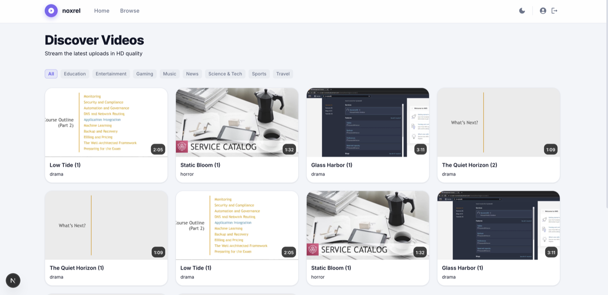
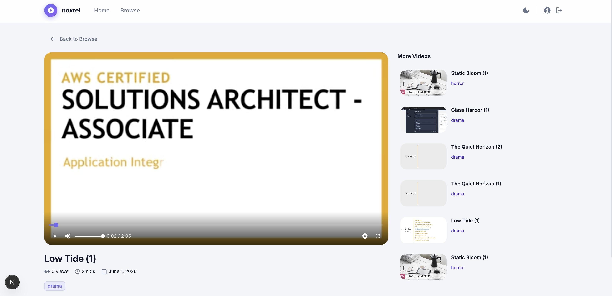
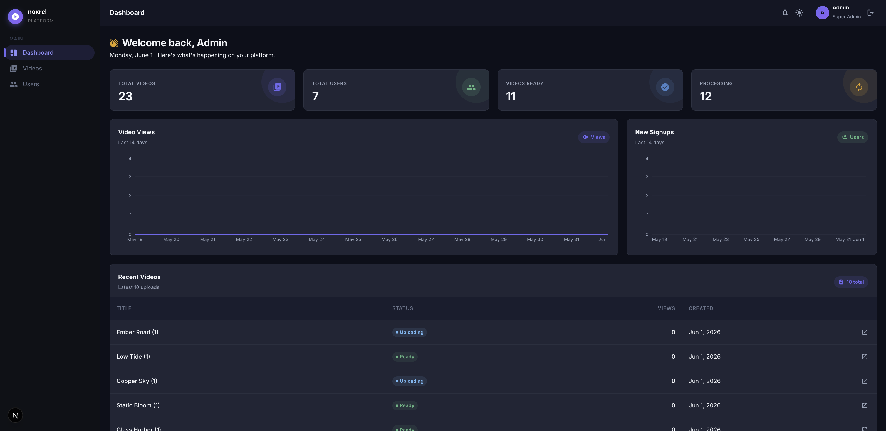
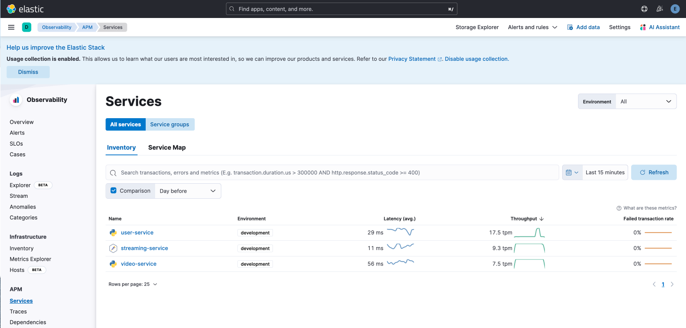
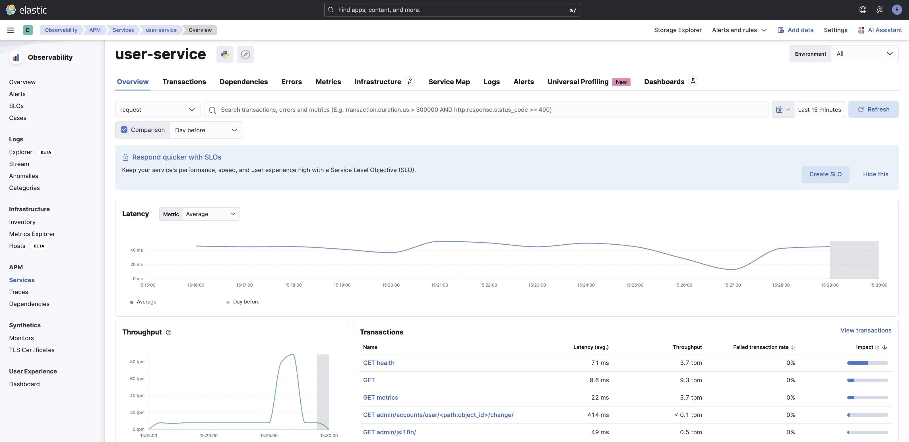
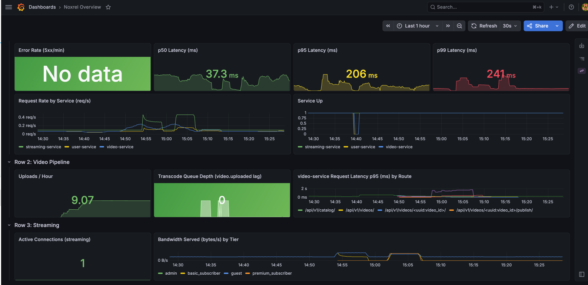
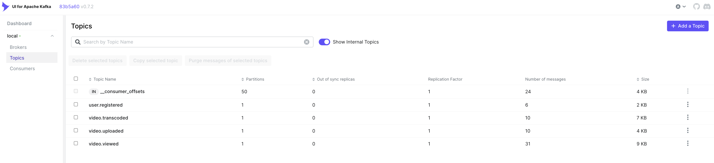

# Noxrel: Video Streaming Platform

A cloud-native, event-driven video streaming platform built as a microservices monorepo.

## Quick Start

Choose one of two ways to run the backend services:

| | [Option A — Docker Compose](#option-a--docker-compose) | [Option B — Kubernetes (minikube)](#option-b--kubernetes-minikube) |
|---|---|---|
| **Best for** | Simple local dev, first-time setup | Learning K8s with real services |
| **What runs in Docker** | Everything | Infrastructure only (Postgres, Redis, Kafka, LocalStack, observability) |
| **What runs in K8s** | — | App services + nginx Ingress |
| **Extra tools needed** | Docker Desktop | Docker Desktop + kubectl + minikube |

Frontend dev servers (`web-user`, `web-admin`) are the same for both options — see [Frontend](#frontend) below.

---

### Common setup (both options)

Complete these steps before following either Option A or Option B.

#### 1. Install git hooks (once per clone)

```bash
make install-hooks
```

This installs [pre-commit](https://pre-commit.com/) hooks that run automatically on every `git commit`.

#### 2. Copy environment files

Each service, frontend, and the infrastructure stack ships an `.env.example`. Copy it to the appropriate local file before starting anything:

```bash
# Infrastructure stack (Elasticsearch/Kibana/Postgres/Grafana dev credentials)
cp infrastructure/.env.example infrastructure/.env

# Backend services (copy to .env)
cp services/user-service/.env.example      services/user-service/.env
cp services/video-service/.env.example     services/video-service/.env
cp services/transcode-worker/.env.example  services/transcode-worker/.env
cp services/streaming-service/.env.example services/streaming-service/.env

# Frontends (copy to .env.local)
cp frontend/web-user/.env.example  frontend/web-user/.env.local
cp frontend/web-admin/.env.example frontend/web-admin/.env.local
```

Edit each file to fill in secrets (JWT keys, etc.) before the first run.

Once done, continue with **[Option A](#option-a--docker-compose)** or **[Option B](#option-b--kubernetes-minikube)**.

---

### Option A — Docker Compose

Everything (infrastructure + all services + Kong) runs in Docker Compose. Kong is available at `localhost:8100` — the frontend `.env.local` files already point there by default.

#### 3a. Start everything

```bash
make up
```

#### Stop (Docker)

```bash
make down
```

---

### Option B — Kubernetes (minikube)

Infrastructure stays in Docker Compose. The four app services run as pods in a local minikube cluster, with nginx Ingress handling routing.

```
┌──────────────────────────────────────────────────────────┐
│  Your local machine                                      │
│                                                          │
│  Docker Compose (make infra-up)                          │
│    postgres:5432   redis:6379   kafka:9092/9094           │
│    localstack:4566  elasticsearch:9200                   │
│    prometheus  grafana  kibana  jaeger                   │
│                                                          │
│  Minikube cluster                                        │
│    user-service      ─┐                                  │
│    video-service      ├─→ host.docker.internal (infra)   │
│    streaming-service  │                                  │
│    transcode-worker  ─┘                                  │
│    nginx Ingress (port 80) ← browser / curl / frontend   │
└──────────────────────────────────────────────────────────┘
```

#### Prerequisites

Install kubectl, minikube, and k9s (optional TUI for cluster browsing):

```bash
# macOS
brew install kubectl minikube k9s

# Linux
curl -LO "https://dl.k8s.io/release/$(curl -sL https://dl.k8s.io/release/stable.txt)/bin/linux/amd64/kubectl"
curl -LO https://storage.googleapis.com/minikube/releases/latest/minikube-linux-amd64
sudo install minikube-linux-amd64 /usr/local/bin/minikube
```

#### 3b. Start minikube and enable nginx Ingress

```bash
minikube start --cpus=3 --memory=4096 --driver=docker
make k8s-ingress-setup
```

#### 4b. Start infrastructure (Docker Compose)

```bash
make infra-up
```

Verify all infra containers are healthy:

```bash
make ps
```

#### 5b. Build service images inside minikube

```bash
make k8s-build
```

This points the Docker CLI at minikube's internal daemon and builds all four service images there. The images never touch Docker Hub.

#### 6b. Deploy to the cluster

```bash
make k8s-up
```

Watch pods start (Django services run DB migrations in an init container first):

```bash
make k8s-status
# or live:
kubectl get pods -n platform -w
```

All pods should reach `Running` / `READY 1/1` within ~2 minutes.

#### 7b. Point the frontends at minikube Ingress

In Kubernetes mode the nginx Ingress is exposed at `<minikube-ip>:80`, not `localhost:8100`. Update both frontend env files:

```bash
MINIKUBE_IP=$(minikube ip)

# web-user — replaces the Docker Compose default (localhost:8100) with the minikube IP
sed -i.bak "s|http://localhost:8100|http://$MINIKUBE_IP|g" frontend/web-user/.env.local

# web-admin
sed -i.bak "s|http://localhost:8100|http://$MINIKUBE_IP|g" frontend/web-admin/.env.local
```

Or edit the files manually and replace `http://localhost:8100` with `http://$(minikube ip)`.

> Revert to `localhost:8100` when switching back to Docker Compose (Option A).

#### 8b. Hit the API through nginx Ingress

```bash
MINIKUBE_IP=$(minikube ip)

# Register a user
curl -X POST http://$MINIKUBE_IP/api/v1/auth/register/ \
  -H "Content-Type: application/json" \
  -d '{"username":"testuser","email":"test@example.com","password":"testpass123"}'

# Login
curl -X POST http://$MINIKUBE_IP/api/v1/auth/login/ \
  -H "Content-Type: application/json" \
  -d '{"username":"testuser","password":"testpass123"}'
```

Or use `minikube tunnel` to expose the Ingress at `localhost` and avoid updating the env files:

```bash
minikube tunnel
# Ingress is now reachable at http://localhost — update .env.local to http://localhost
```

#### Kubernetes workflow commands

| Command | What it does |
|---|---|
| `make k8s-ingress-setup` | Enable nginx Ingress addon in minikube (once per cluster) |
| `make k8s-build` | Build all 4 service images inside minikube |
| `make k8s-up` | Apply all K8s manifests (namespace, configmaps, secrets, services, ingress) |
| `make k8s-down` | Delete all services/configmaps/secrets/ingress from the cluster |
| `make k8s-status` | Show pod status in the `platform` namespace |
| `make k8s-logs SVC=user-service` | Tail logs for a service |
| `make k8s-restart SVC=user-service` | Rolling restart after a configmap/secret change |

#### After changing a ConfigMap or Secret

```bash
# Re-apply the changed file
kubectl apply -f infrastructure/k8s/configmaps/user-service.yml

# Trigger a rolling restart so pods pick up the new values
make k8s-restart SVC=user-service
```

#### Stop (Kubernetes)

```bash
make k8s-down       # remove services from cluster
make infra-down     # stop Docker Compose infrastructure
minikube stop       # stop the cluster (preserves state)
# minikube delete   # full teardown — removes all cluster data
```

---

### Frontend

Frontend dev servers are independent of Docker vs. Kubernetes — start them the same way either way.

```bash
# Install npm dependencies (once after cloning, or after package changes)
make frontend-install

# Start both frontend dev servers (web-user: 3000, web-admin: 3001)
make frontend-start
```

`frontend-start` is equivalent to `frontend-install` + `frontend-dev`. Use `make frontend-dev` to skip the install step on subsequent runs.

```bash
# Stop frontend dev servers
make frontend-stop
```

---

## Useful commands

```bash
# Tail all Docker Compose service logs
make logs

# Inspect LocalStack S3 buckets
aws --endpoint-url=http://localhost:4566 s3 ls
```

---

## API Gateway

### Docker Compose (Option A) — Kong on port 8100

All browser/client API traffic goes through Kong:

```
http://localhost:8100/api/v1/auth/*        → user-service:8000
http://localhost:8100/api/v1/users/*       → user-service:8000
http://localhost:8100/api/v1/roles/*       → user-service:8000
http://localhost:8100/api/v1/permissions/* → user-service:8000
http://localhost:8100/api/v1/videos/*      → video-service:8001
http://localhost:8100/api/v1/catalog/*     → video-service:8001
http://localhost:8100/api/v1/stream/*      → streaming-service:3002
```

Kong admin API (inspect live config/routes): `http://localhost:8101`

Kong is configured in **DB-less declarative mode** — all config lives in `infrastructure/kong/kong.yml`. Reload after changes with `docker exec infrastructure-kong-1 kong reload`.

### Kubernetes (Option B) — nginx Ingress on port 80

The same routes are served by the nginx Ingress controller at `http://$(minikube ip)`:

```
http://<minikube-ip>/api/v1/auth/*        → user-service:8000
http://<minikube-ip>/api/v1/users/*       → user-service:8000
http://<minikube-ip>/api/v1/roles/*       → user-service:8000
http://<minikube-ip>/api/v1/permissions/* → user-service:8000
http://<minikube-ip>/api/v1/videos/*      → video-service:8001
http://<minikube-ip>/api/v1/catalog/*     → video-service:8001
http://<minikube-ip>/api/v1/stream/*      → streaming-service:3002
```

## Architecture

| Service | Tech | DB | Description |
|---|---|---|---|
| auth-service | FastAPI | PostgreSQL + Redis | RS256 JWT issuance, login, token refresh |
| user-service | Django REST | PostgreSQL + Redis | Profiles, RBAC, trial tracking |
| video-service | Django REST | PostgreSQL + S3 | Multipart upload orchestration, video catalog, transcode trigger |
| transcode-worker | Python + FFmpeg | S3 | Async video transcoding |
| streaming-service | Fastify (Node.js) | Redis | HLS/DASH manifest serving |
| live-service | Node.js + nginx-rtmp | Redis | RTMP ingest + live HLS |
| social-service | FastAPI | MongoDB | Comments, likes, follows |
| billing-service | Django REST | PostgreSQL | Subscriptions, payments |
| search-service | FastAPI | Elasticsearch | Full-text video/channel search |
| notification-service | FastAPI | — | Email, push, in-app notifications |
| ai-service | FastAPI + Claude API | PostgreSQL + Redis | AI-powered features |
| web-user | Next.js | — | Viewer-facing app (port 3000) |
| web-admin | Next.js | — | Admin dashboard (port 3001) |

## Local Infrastructure

| Service | Port | Notes |
|---|---|---|
| PostgreSQL | 5432 | |
| MongoDB | 27017 | |
| Redis | 6379 | |
| Elasticsearch | 9200 | Log storage, APM data |
| Kafka | 9092 | |
| LocalStack (AWS) | 4566 | S3, SQS, SNS, SSM, Secrets Manager |
| OTel Collector | 4317 / 4318 | gRPC / HTTP — services send traces here |
| APM Server | 8200 | Elastic APM — services send APM data here |
| Fluent Bit | 24224 | Centralized log collector (fluentd protocol) |
| Redis exporter | 9121 | Redis metrics for Prometheus |
| Kafka exporter | 9308 | Kafka consumer-lag metrics for Prometheus |
| **Kong proxy** | **8100** | **All API traffic goes here** |
| Kong admin | 8101 | Status, route inspection |
| user-service | 8000 | Direct access (bypasses Kong) |
| video-service | 8001 | Direct access (bypasses Kong) |
| streaming-service | 3002 | Direct access (bypasses Kong) |

## Local UIs

All browser-accessible endpoints in one place:

| UI | URL | Credentials | Description |
|---|---|---|---|
| **web-user** | `http://localhost:3000` | — | Viewer-facing frontend |
| **web-admin** | `http://localhost:3001` | — | Admin dashboard frontend |
| **Kafka UI** | `http://localhost:8080` | — | Browse topics, messages, consumer groups |
| **Jaeger** | `http://localhost:16686` | — | Distributed traces across services |
| **Grafana** | `http://localhost:3003` | `admin` / `admin` | Noxrel Overview dashboard (auto-provisioned) |
| **Kibana → Discover** | `http://localhost:5601` | `elastic` / `noxrel_dev` | Structured JSON logs, filterable by `trace_id` / `service` |
| **Kibana → APM** | `http://localhost:5601/app/apm` | `elastic` / `noxrel_dev` | Latency, error rate, throughput per service |
| **Prometheus** | `http://localhost:9090` | — | Raw metrics, ad-hoc PromQL queries |
| **Elasticsearch** | `http://localhost:9200` | `elastic` / `noxrel_dev` | Raw ES API (log/APM indices) |
| **Kong admin** | `http://localhost:8101` | — | Inspect live routes and Kong config |
| **user-service Django admin** | `http://localhost:8000/admin/` | `admin@admin.com` / `admin1234` | Manage users, roles, permissions |
| **video-service Django admin** | `http://localhost:8001/admin/` | *(create via manage.py)* | Manage video metadata |

> **user-service admin credentials** are set by `DEV_ADMIN_EMAIL`, `DEV_ADMIN_USERNAME`, and `DEV_ADMIN_PASSWORD` in `services/user-service/.env`. Defaults: email `admin@admin.com`, password `admin1234`. The account is created automatically on first boot, or manually with:
> ```bash
> docker exec -it infrastructure-user-service-1 uv run python manage.py create_dev_admin
> ```

> **Elasticsearch / Kibana credentials** — Elasticsearch security is enabled so Kibana can install the Fleet APM integration (required for the APM service inventory to populate). The dev-only superuser is `elastic` / `noxrel_dev`; Kibana authenticates internally as `kibana_system` / `noxrel_dev`. The password is sourced from `ELASTIC_PASSWORD` in `infrastructure/.env` (copied from `infrastructure/.env.example`, see Quick Start step 2) — for local dev only; rotate via AWS Secrets Manager in production.

## Observability

All four implemented services are instrumented with OpenTelemetry. Traces, logs, and metrics flow through a central collector.

| What you see | Where |
|---|---|
| Distributed traces (follow a request across services) | Jaeger `http://localhost:16686` |
| Noxrel health, video pipeline, streaming, infra metrics | Grafana `http://localhost:3003` (`admin` / `admin`) |
| Structured JSON logs, filter by `trace_id` / `service` | Kibana Discover `http://localhost:5601` (`elastic` / `noxrel_dev`) |
| Latency, error rate, throughput per service | Kibana APM `http://localhost:5601/app/apm` (`elastic` / `noxrel_dev`) |
| Raw PromQL queries | Prometheus `http://localhost:9090` |

## Screenshots

### Frontends

<table>
<tr>
<td align="center" width="50%"><b>User App — Browse</b><br/></td>
<td align="center" width="50%"><b>User App — Video Playback</b><br/></td>
</tr>
<tr>
<td align="center" colspan="2"><b>Admin Dashboard</b><br/></td>
</tr>
</table>

### Observability

<table>
<tr>
<td align="center" width="50%"><b>Kibana APM — All Services</b><br/></td>
<td align="center" width="50%"><b>Kibana APM — user-service Detail</b><br/></td>
</tr>
<tr>
<td align="center" width="50%"><b>Grafana — Noxrel Overview</b><br/></td>
<td align="center" width="50%"><b>Kafka UI — Topics</b><br/></td>
</tr>
</table>

---

## Git Workflow

### Commit message format

All commits must follow [Conventional Commits](https://www.conventionalcommits.org/). The `commit-msg` hook enforces this automatically.

```
<type>(<scope>): <description>

feat(user-service): add email verification endpoint
fix(auth-service): refresh token expiry off by one
docs: update local dev setup in README
ci: add billing-service to test matrix
```

**Allowed types:** `feat` `fix` `docs` `style` `refactor` `perf` `test` `build` `ci` `chore` `revert`

**Breaking change:** append `!` before the colon — `feat(auth)!: drop v1 token support`

### What the hooks check on every commit

| Hook | What it does |
|---|---|
| `trailing-whitespace` | Strips trailing whitespace |
| `end-of-file-fixer` | Ensures files end with a newline |
| `check-yaml` / `check-json` / `check-toml` | Validates config file syntax |
| `check-merge-conflict` | Blocks accidental merge conflict markers |
| `detect-private-key` | Blocks accidental secret commits |
| `check-added-large-files` | Blocks files > 1 MB |
| `ruff` (with `--fix`) | Lints Python, auto-fixes what it can |
| `ruff-format` | Formats Python code |
| `mypy` | Type-checks all services |
| `commitizen` | Validates conventional commit format |

### Run all checks manually (without committing)

```bash
make lint
```

### Bypass hooks in an emergency

```bash
git commit --no-verify -m "chore: emergency hotfix"
```

Use sparingly — CI runs the same checks and will catch any bypass.

## Services

| Service | Status | README |
|---|---|---|
| user-service | ✅ implemented | [services/user-service/README.md](services/user-service/README.md) |
| video-service | ✅ implemented | [services/video-service/README.md](services/video-service/README.md) |
| transcode-worker | ✅ implemented | [services/transcode-worker/README.md](services/transcode-worker/README.md) |
| streaming-service | ✅ implemented | [services/streaming-service/README.md](services/streaming-service/README.md) |
| web-admin | ✅ implemented | [frontend/web-admin/README.md](frontend/web-admin/README.md) |
| live-service | planned | — |
| social-service | planned | — |
| billing-service | planned | — |
| search-service | planned | — |
| notification-service | planned | — |
| ai-service | planned | — |
| web-user | ✅ implemented | [frontend/web-user/README.md](frontend/web-user/README.md) |

## Repository Layout

```
services/          # Backend microservices
frontend/          # Next.js apps (web-user, web-admin)
infrastructure/    # Docker Compose, Terraform, LocalStack init scripts
docs/              # Architecture docs and per-phase implementation guides
.github/workflows/ # CI: lint + test matrix per service
```

## Key Conventions

- Every service exposes a `/health` endpoint.
- All logging is structured JSON: `{ts, level, service, message, trace_id, request_id}`.
- Config via environment variables — never commit secrets.
- DB migrations: Alembic (FastAPI), Django migrations (Django).
- Cross-service async communication via Kafka; every consumer has a DLQ.

## License

MIT License — see [LICENSE](LICENSE) for details.
